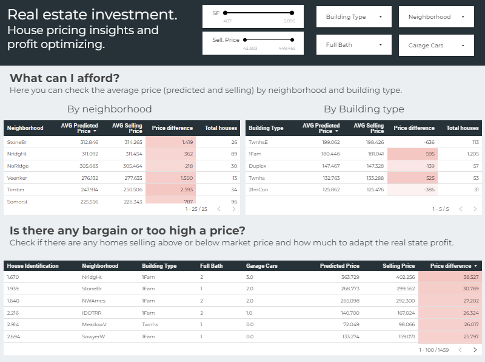
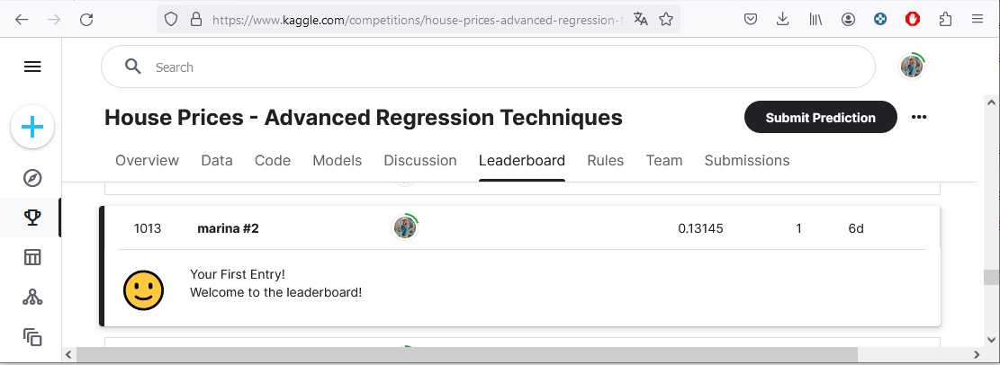

# A real-life example of a regression problem with business-minded aspects: estimating the selling price of a house
The purpose of this project is to deal with a **real world regression problem and approach it with a business concern**: from explaining the insights we can get just from the data, find a ML model that would fit on the regression problem and finally put into production the model and the insights we can get from it.

For this project I've chosen this Kaggle dataset: [House Prices - Advanced Regression Techniques](https://www.kaggle.com/competitions/house-prices-advanced-regression-techniques/overview). This dataset contains information of houses sold in Illinois, US, from 2006 to 2010. The final objective of the project is to find a model able to predict the selling price of a house. This is a real business concern because knowing the market price of a house (or any product) gives competitive advantage for the buyer and for the seller. Buyers and sellers will have an estimation of an upper/lower threshold to decide which is the right price to minimize/maximize the selling price, respectively. Also, real estate businesses can take advantage of this information maximizing the profit they make with any sale. So, the objective here is to **predict in advance the selling price of a house** in order to increment the benefits of all the players involved in the sale/purchase of a house.

Final results are presented in a user friendly [report](https://lookerstudio.google.com/reporting/69313d85-34c5-4552-b44d-cefe48c3a18f?s=p-JgLucqaOc):

The results of the best model found in [this project](https://github.com/MarinaMoreno/Estimating-the-selling-price-of-a-house-Regression-/blob/main/Estimating%20the%20selling%20price%20of%20a%20house%20(Regression).ipynb) have been submitted to the [Kaggle competition](https://www.kaggle.com/competitions/house-prices-advanced-regression-techniques/leaderboard)
 and currently the rating of the results is among the top 33%:

